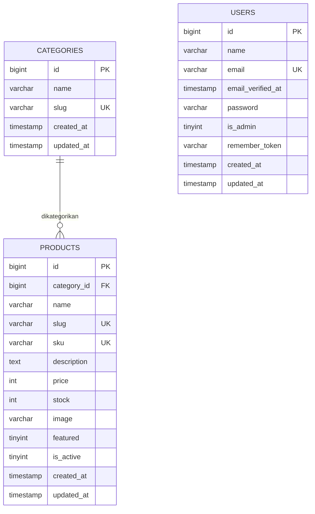

# ERD — Rizqy Utama Electric

Basis data `rizqyutamaelectric` dipakai **bersama** oleh storefront (`:3000`)
dan panel admin (`:3001`). Skema ini sudah ada sebelum panel dibuat dan
**tidak diubah** oleh panel: tidak ada tabel baru, tidak ada migrasi.

> **Catatan (versi Supabase).** Storefront dan panel saat ini memakai **Supabase
> (Postgres)**; skema resminya ada di `rizqyutamaelectric/supabase/schema.sql`
> (`users`, `categories`, `products` dengan kolom boolean `is_admin`,
> `featured`, `is_active`, dan `price`/`stock` bertipe `integer`). Diagram &
> DDL di bawah ini adalah versi MySQL asli dan tetap berlaku untuk mode
> cadangan. Perbedaan praktis bagi panel: `id` adalah `bigint identity`, dan
> nilain boolean dikirim sebagai `true/false` (bukan `1/0`).

Rincian kebutuhan produk ada di [PRD.md](./PRD.md).

---

## 1. Diagram Relasi



Relasi:

| Dari | Ke | Jenis | Keterangan |
| --- | --- | --- | --- |
| `categories` | `products` | 1 → *N* | Satu kategori punya banyak produk |
| `products` | `categories` | *N* → 1 | Setiap produk wajib punya tepat satu kategori |
| `users` | — | mandiri | Tidak berelasi; hanya dipakai untuk login panel |

`users` sengaja tidak punya foreign key karena panel tidak pernah mengubah
baris user — tabel ini hanya dibaca untuk memverifikasi login.

## 2. Definisi Tabel

### `users`

| Kolom | Tipe | Null | Default | Keterangan |
| --- | --- | --- | --- | --- |
| `id` | `bigint unsigned` | no | auto_increment | PK |
| `name` | `varchar(255)` | no | — | Nama admin |
| `email` | `varchar(255)` | no | — | **UNIQUE**, dipakai saat login |
| `email_verified_at` | `timestamp` | yes | `NULL` | DiReserved untuk kompatibilitas |
| `password` | `varchar(255)` | no | — | Hash bcrypt, bukan teks biasa |
| `is_admin` | `tinyint(1)` | no | `0` | Hanya `1` yang boleh login ke panel |
| `remember_token` | `varchar(100)` | yes | `NULL` | Tidak dipakai panel (login pakai cookie session) |
| `created_at` | `timestamp` | yes | `NULL` | Waktu dibuat |
| `updated_at` | `timestamp` | yes | `NULL` | Waktu diubah |

Index: `PRIMARY KEY (id)`, `UNIQUE KEY users_email_unique (email)`

### `categories`

| Kolom | Tipe | Null | Default | Keterangan |
| --- | --- | --- | --- | --- |
| `id` | `bigint unsigned` | no | auto_increment | PK |
| `name` | `varchar(255)` | no | — | Nama kategori, mis. "MCB & Panel" |
| `slug` | `varchar(255)` | no | — | **UNIQUE**, dipakai URL filter |
| `created_at` | `timestamp` | yes | `NULL` | Waktu dibuat |
| `updated_at` | `timestamp` | yes | `NULL` | Waktu diubah |

Index: `PRIMARY KEY (id)`, `UNIQUE KEY categories_slug_unique (slug)`

### `products`

| Kolom | Tipe | Null | Default | Keterangan |
| --- | --- | --- | --- | --- |
| `id` | `bigint unsigned` | no | auto_increment | PK |
| `category_id` | `bigint unsigned` | no | — | **FK** → `categories.id`, `ON DELETE CASCADE` |
| `name` | `varchar(255)` | no | — | Nama produk |
| `slug` | `varchar(255)` | no | — | **UNIQUE**, dipakai URL detail toko |
| `sku` | `varchar(255)` | yes | `NULL` | **UNIQUE**; beberapa `NULL` diizinkan di MySQL |
| `description` | `text` | yes | `NULL` | Maks 65.535 byte |
| `price` | `int unsigned` | no | — | Rupiah penuh, maks `4.294.967.295` |
| `stock` | `int unsigned` | no | `0` | Maks `4.294.967.295` |
| `image` | `varchar(255)` | yes | `NULL` | URL absolut dari `ADMIN_PUBLIC_URL`, atau URL eksternal |
| `featured` | `tinyint(1)` | no | `0` | Tampilkan di etalase depan |
| `is_active` | `tinyint(1)` | no | `1` | Hanya `1` yang tampil di storefront |
| `created_at` | `timestamp` | yes | `NULL` | Waktu dibuat |
| `updated_at` | `timestamp` | yes | `NULL` | Waktu diubah |

Index & constraint:

```sql
PRIMARY KEY (`id`),
UNIQUE KEY `products_slug_unique` (`slug`),
UNIQUE KEY `products_sku_unique` (`sku`),
KEY `products_category_id_foreign` (`category_id`),
KEY `products_is_active_featured_index` (`is_active`, `featured`),
CONSTRAINT `products_category_id_foreign`
  FOREIGN KEY (`category_id`) REFERENCES `categories` (`id`) ON DELETE CASCADE
```

## 3. DDL Lengkap

```sql
CREATE TABLE `users` (
  `id` bigint unsigned NOT NULL AUTO_INCREMENT,
  `name` varchar(255) COLLATE utf8mb4_unicode_ci NOT NULL,
  `email` varchar(255) COLLATE utf8mb4_unicode_ci NOT NULL,
  `email_verified_at` timestamp NULL DEFAULT NULL,
  `password` varchar(255) COLLATE utf8mb4_unicode_ci NOT NULL,
  `is_admin` tinyint(1) NOT NULL DEFAULT '0',
  `remember_token` varchar(100) COLLATE utf8mb4_unicode_ci DEFAULT NULL,
  `created_at` timestamp NULL DEFAULT NULL,
  `updated_at` timestamp NULL DEFAULT NULL,
  PRIMARY KEY (`id`),
  UNIQUE KEY `users_email_unique` (`email`)
) ENGINE=InnoDB DEFAULT CHARSET=utf8mb4 COLLATE=utf8mb4_unicode_ci;

CREATE TABLE `categories` (
  `id` bigint unsigned NOT NULL AUTO_INCREMENT,
  `name` varchar(255) COLLATE utf8mb4_unicode_ci NOT NULL,
  `slug` varchar(255) COLLATE utf8mb4_unicode_ci NOT NULL,
  `created_at` timestamp NULL DEFAULT NULL,
  `updated_at` timestamp NULL DEFAULT NULL,
  PRIMARY KEY (`id`),
  UNIQUE KEY `categories_slug_unique` (`slug`)
) ENGINE=InnoDB DEFAULT CHARSET=utf8mb4 COLLATE=utf8mb4_unicode_ci;

CREATE TABLE `products` (
  `id` bigint unsigned NOT NULL AUTO_INCREMENT,
  `category_id` bigint unsigned NOT NULL,
  `name` varchar(255) COLLATE utf8mb4_unicode_ci NOT NULL,
  `slug` varchar(255) COLLATE utf8mb4_unicode_ci NOT NULL,
  `sku` varchar(255) COLLATE utf8mb4_unicode_ci DEFAULT NULL,
  `description` text COLLATE utf8mb4_unicode_ci,
  `price` int unsigned NOT NULL,
  `stock` int unsigned NOT NULL DEFAULT '0',
  `image` varchar(255) COLLATE utf8mb4_unicode_ci DEFAULT NULL,
  `featured` tinyint(1) NOT NULL DEFAULT '0',
  `is_active` tinyint(1) NOT NULL DEFAULT '1',
  `created_at` timestamp NULL DEFAULT NULL,
  `updated_at` timestamp NULL DEFAULT NULL,
  PRIMARY KEY (`id`),
  UNIQUE KEY `products_slug_unique` (`slug`),
  UNIQUE KEY `products_sku_unique` (`sku`),
  KEY `products_category_id_foreign` (`category_id`),
  KEY `products_is_active_featured_index` (`is_active`, `featured`),
  CONSTRAINT `products_category_id_foreign`
    FOREIGN KEY (`category_id`) REFERENCES `categories` (`id`) ON DELETE CASCADE
) ENGINE=InnoDB DEFAULT CHARSET=utf8mb4 COLLATE=utf8mb4_unicode_ci;
```

## 4. Aturan Integritas yang Dijalankan Aplikasi

MySQL sudah menjamin sebagian aturan (FK, unique, cascade). Sisanya
dijalankan panel agar pengguna mendapat pesan ramah, bukan error 500.

| Aturan | Dijamin oleh | Perilaku panel |
| --- | --- | --- |
| `slug` produk unik | MySQL | Dibuat otomatis + suffix angka bila bentrok (`kabel`, `kabel-2`, ...) |
| `sku` produk unik | MySQL | Dicek sebelum insert/update, ditolak dengan pesan jelas |
| `name` wajib | MySQL | Divalidasi, pesan "Nama produk wajib diisi." |
| `price`/`stock` ≥ 0 | `int unsigned` | Divalidasi di aplikasi agar tidak jadi error 500 |
| `price`/`stock` ≤ `4.294.967.295` | `int unsigned` | Divalidasi di aplikasi (`MAX_UNSIGNED_INT`) |
| Panjang ≤ 255 karakter | `varchar(255)` | Divalidasi di aplikasi (`MAX_VARCHAR`) |
| Deskripsi ≤ 65.535 byte | `TEXT` | Divalidasi dengan `Buffer.byteLength` |
| `category_id` ada | FK | Divalidasi lebih dulu, pesan "Kategori tidak ditemukan." |
| Hapus kategori yang terpakai | `ON DELETE CASCADE` | **Ditolak** di UI dan di Server Action untuk mencegah penghapusan massal diam-diam |

## 5. Konvensi

- **Engine & collation:** InnoDB, `utf8mb4_unicode_ci` untuk semua tabel.
- **Timestamp:** kolom `created_at` dan `updated_at` nullable; diisi
  otomatis oleh MySQL karena tidak di-set eksplisit di `CREATE TABLE`.
- **ID:** `bigint unsigned` auto-increment, dimulai dari 1.
- **Slug:** selalu ASCII lowercase dengan pemisah `-`, maksimal 180 karakter
  (dibatasi di `lib/slugify.ts`).

## 6. Data Awal

| Tabel | Jumlah | Keterangan |
| --- | --- | --- |
| `users` | 1 | akun admin awal (`is_admin = true`); kredensial dibuat sendiri, tidak ada default di repo |
| `categories` | 6 | Kabel, MCB & Panel, Saklar & Stop Kontak, Lampu & LED, Pipa & Aksesoris, Alat Ukur |
| `products` | 12 | Seluruhnya `is_active = 1` dan `image = NULL` |

> **Buat/ubah password adminmu sendiri.** Hash baru dibuat dengan
> bcrypt, bukan teks biasa:
>
> ```sql
> UPDATE users SET password = '<hash bcrypt>' WHERE email = '<email adminmu>';
> ```
